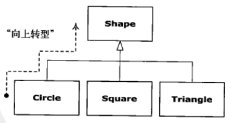

 最近在导师的要求下开始加强Java基础，所以找了本《Thinking in Java》(Java编程思想)来看看，顺便做点笔记来证明自己看过，所以《Java基础知识》系列博客都是这本书的读书笔记。

<!--more-->

## 1 抽象过程

汇编语言是对底层机器的轻微抽象，命令式语言（如C语言）是对汇编语言的抽象。

程序员必须建立起在机器模型（位于“解空间”内，这是对问题建模的地方，如计算机）和实际问题的模型（位于“问题空间”内，这是问题存在的地方，如一项业务）之间的关联。
**面向对象**方式把问题空间中的元素抽象为对象，程序可以通过添加新类型的对象使自身适应于某个特定问题，当我们在阅读描述解决方案的代码时，也是在阅读问题的描述。

面向对象语言的五个特性：

1）万物皆对象。

2）程序是对象的集合，它们通过发送消息来告知彼此所要做的。

3）每个对象都有自己的由其他对象所构成的存储。

4）每个对象都有其类型。即每个对象都是某个**类**（class）的一个**实例**（instance）。

5）某一特定类型的所有对象都可以接收同样的消息。

## 2 每个对象都有一个接口


**接口**确定了对某一特定对象所能发出的请求。但是，在程序中必须有满足这些请求的代码，这些代码和隐藏的数据一起构成了**实现**。

## 3 每个对象都提供服务

程序本身向用户提供服务，它将通过调用其他对象提供的服务来实现这一目的。

在良好的面向对象设计中，每个对象都可以很好的完成一项任务，但它并不试图做更多的事。

## 4 被隐藏的具体实现

将程序开发人员按角色分为**类创建者**和**客户端程序员**（就好比一个类库的创建者和它的使用者）是大有裨益的。类创建者的目标是构建类，这种类只向客户端程序员暴露必须的部分（例如接口），而隐藏其他部分（例如实现）。这意味着类创建者可以任意修改被隐藏的部分，而不用担心对其他任何人造成影响。

访问控制的第一个存在原因是让客户端程序员无法触及他们不应该触及的部分，第二个原因是允许库设计者可以改变类内部的工作方式而不用担心会影响到客户端程序员。

Java用三个关键字控制访问：**public**，**private**，**protected**。public表示紧随其后的元素对任何人都是可用的，而private表示除类型创建者和类型内部方法之外的任何人都不能访问，protected与private的作用相当，差别在于继承的类可以访问protected成员，却不能访问private成员。

## 5 复用具体实现

最简单的复用某个类的方式就是直接使用该类的一个对象，此外也可以把那个类的一个对象置于某个新的类中。新的类可以由任意数量、任意类型的其他对象以任意可以实现新的类中想要的功能的方式所组成。

因为是在使用现有的类新的类，所以这种概念被成为组合（competition），如果组合是动态发生的，那么它通常被称为聚合（aggregation）。

组合通常被视为“**has-a**”（拥有）关系，就像我们常说“汽车拥有一个引擎”。

组合带来了极大的灵活性，新类成员对象通常被声明为private，使得使用新类的客户端程序员不能访问它们，这也使得你可以在不干扰现有客户端代码的情况下，修改这些成员。也可以在运行时修改这些成员对象，以实现动态修改程序的行为。

## 6 继承

继承就是以现有类为基础，复制它，然后通过添加和修改这个副本来创建新类。

当源类（也被称为**父类**）发生变动时，被修改过的副本（被称为**子类**）也会反映出这些变动。

继承现有类型时，也就创造了新的类型。这个新的类型不仅包含现有类型的所有成员（尽管private成员被隐藏起来，并且不可访问），而且更重要的是它复制了父类的接口。也就是说，所有可以发送给父类对象的消息同时也可以发送给子类对象。

有两种方法可以使父类与子类产生差异。第一种方法是直接在子类中添加新的方法，这意味着父类不能直接满足你的需求，必须添加更多方法。第二种也是更重要的一种方法是在子类中改变父类方法的行为，这被称为**覆盖**（需要添加@override注解）。

假如继承只覆盖父类的方法，而并不添加在父类中没有的新方法，就意味着子类和父类时完全相同的类型，具有完全相同的接口，可以用一个子类对象来完全替代一个父类对象（被称为纯粹替代），我们经常将这种情况下子类与父类之间的关系称为**is-a（是一个）**关系。

有时必须在子类中添加新的接口元素，这个新类型仍可替代父类，但这种替代并不完美，因为基类无法访问新添加的方法。这种情况我们描述为**is-like-a（像是一个）**关系。

## 7 伴随多态的可互换对象



```java
void doSomething(Shape shape){
	shape.erase();
    shape.draw();
}
```

该方法可以与任何Shape对话，如果在其他地方调用了doSomething()方法:

```java
Circle circle = new Circle();
Square square = new Square();
Triangle triangle = new Triangle();
doSomething(circle);
doSomething(square);
doSomething(triangle);
```

对doSomething()方法的调用都会正确的执行，而不管对象的确切类型。

把子类看做它的父类的过程称为**向上转型（upcasting）**。

## 8 单根继承结构

在Java中，所有的类最终都继承自单一的父类（**Object**类）。

单根继承结构使垃圾回收器的实现变得容易许多，而垃圾回收器是Java相对C++的重要改进之一（Java是基于C++的）。

## 9 容器

创建一种新的对象类型，这种新的对象类型持有其他对象的引用（或者使用数组类型来实现这一功能），这种新的类型被称为容器。

Java在其标准类库中包含了大量的容器，例如List（用于存储序列），Map（关联数组，用来建立对象之间的关联），Set（每种类型的对象只持有一个）。以及诸如队列、树、堆栈等更多的构件。

Java拥有多种类型的容器的原因有两个，第一，不同容器提供不同类型的接口和外部行为；第二，不同容器对于某些操作具有不同的效率。

## 10 对象的创建和生命期

每个对象为了生存都需要资源，尤其是内存，当我们不需要一个对象时，它必须被清理掉，使其占用的资源可以被释放掉和重用。

Java完全使用动态内存分配方式（在被称为堆（heap）的内存池中动态的创建对象）。每当想要创建一个新的对象时，就要使用new关键字来构建此对象的动态实例。

java使用垃圾回收器来处理内存释放问题，垃圾回收器知道对象何时不再被使用，并自动释放对象占用的内存。

## 11 异常处理：处理错误

异常是一种对象，它在出错地点被抛出，并被专门设计用来处理特定类型错误的相应的异常处理器捕获。

异常处理就像是与程序正常执行路径并行的、在错误发生时执行另一条路径。

异常提供了一种从错误状况进行可靠恢复的途径，现在不再是只能退出程序，你可以经常进行校正，并恢复程序的执行，这些都有助于编写出更健壮的程序。

如果没有编写正确的异常处理代码，那么就会得到一条编译时的出错信息。

## 12 并发编程

把问题切分为多个可独立运行的部分（任务），从而提高程序的响应能力，这些彼此独立运行的部分称之为**线程**，上述概念被称为**并发**。

多个并行任务使用一个共享资源的过程是：某个任务锁定某项资源，完成其任务，然后释放资源锁，使其他任务可以使用这项资源。

