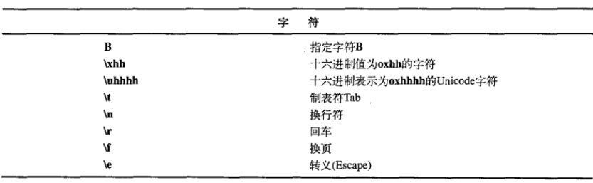
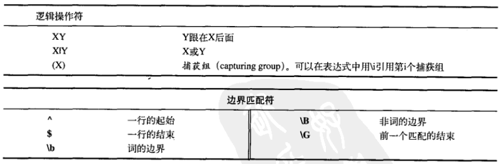

### 1、不可变String

String对象是不可变的（final的）。String类中每一个看起来会修改String值的方法实际都是创建了一个全新的String对象，以包含修改后的字符串内容，而最初的String对象则丝毫未动。

### 2、重载“+”与StringBuilder

String对象具有只读特性，指向它的任何引用都不可能改变它的值。

不可变性会带来一定的效率问题。String对象重载的“+”操作符就是一个例子。重载的意思是，一个操作符在应用与特定的类时，被赋予了特殊的意义（用于String的“+”与“+=”是Java中仅有的两个重载过的操作符，而java不允许程序员重载任何操作符）。

<!--more-->

操作符“+”可以用来连接String，但编译器在工作时，实际是创建了一个StringBuilder对象（在Java SE5之前，用的是StringBuffer，它是线程安全的），并调用它的append方法把字符串连接起来，最好调用toString方法生成结果。如果使用append(str1 + ":" + str2)，这样编译器会创建另一个StringBuilder对象处理括号内的字符串操作，所以最好不要这样做。

### 3、无意识的递归

每个类都继承自Object，因此每个类都有toString方法。如果你希望toString方法打印出对象的内存地址，也许你会考虑this关键字，例:

```java
public String toString(){
	return "address: " + this;
}
```

当你创建对象，并将其打印出来的时候，会得到一串非常长的异常。其实，当上面的代码运行时，因为编译器看到一个String对象后面跟着一个“+”，而再后面的对象不是String，于是编译器试着把this转换成一个String，这就会调用this上的toString方法，于是发生了递归调用。如果真的想打印出对象的内存地址，应该调用super.toString()方法。

### 4、String上的操作

详情看jdk文档。

### 5、格式化输出

类似C语言的格式化输出，两种方法：

```java
System.out.format("Row 1: [%d %f]\n",x,y);
System.out.printf("Row 1: [%d %f]\n",x,y);
```

在Java中，所有新的格式化功能都由java.util.Formatter类处理。当你创建一个Formatter对象时。需要向其构造器传递一些信息，告诉它最终的结果将向哪里输出。例：

```java
Formatter f = new Formatter(System.out);
f.format("%s The Turtle is at (%d, %d)\n", name, x, y);
```

Formatter的构造器经过重载可以接受多种输出目的地，不过最常用的还是PrintStream()（如上例）、OutputStream和File。

格式化说明符：

插入数据时，如果想控制空格与对齐，需要更加复杂精细的格式修饰符，以下是其抽象语法：

```
%[flags][width][.precision]conversion
```

flags控制对齐。默认是右对齐，使用“-”改变对齐方向。width控制一个域的最小长度，必要时添加空格来达到最小长度。precision指明数据的最大尺寸，但是将它应用于浮点数时，表示小数部分要显示出来位数（默认6位），如果小数位数过多则舍入，太少则在尾部补0；应用于整数时则会触发异常。例：%-15.15s表示这个域的最小长度是15个字符，字符串的最大长度是15，过长则截断，过短则加空格，对齐方式是左对齐。%15.10s表示右对齐，域的最小长度是15个字符，字符串的最大长度是10，如果字符串长度大于10，则截断，再在前面加5个空格（说明域的最小长度width可以大于数据的最大长度precision，这两个长度指的不是同一个东西）。%10.2f说明右对齐，域的最小长度是10，小数位数是2。

String.format()是一个static方法，它接受与Formatter.format()方法一样的参数，但返回一个对象。

### 6、正则表达式

**-？** 表示可能有一个负号，有或没有都能匹配，？表示可能有一个东西。

正则表达式中\d表示一位数字，而在java中要用\\\d表示，因为java中的\\\表示正则表达式中的反斜线，其后的字符具有特殊意义。正则表达式中\\\代表一个普通的反斜线，而在java中要表示为\\\\\\\（java中表示一个反斜线也要在它前面加一个反斜线进行转义，所以后两个反斜线表示java中的字符\）.

要表示一个或多个之前的表达式，应该使用+。因此，要表示“可能有一个负号，后面跟着一个或多个数字”，可以这样：**-？\\\d+**。例：

```java
public class IntegerMatch {
    public static void main(String[] args) {
        System.out.println("-1234".matches("-?\\d+"));
        System.out.println("5678".matches("-?\\d+"));
        System.out.println("+1234".matches("-?\\d+"));
        System.out.println("+5678".matches("(-|\\+)?\\d+"));
    }
}
/* output:
true
true
false
true
 */
```

在正则表达式中，括号有着将表达式分组的效果，|表示或操作，+在正则表达式里有特殊意义，所以表示一个普通加号要进行转义。正则表达式里的空格会影响匹配，所以不要为了表达式好看而加空格。

String类的split()方法的功能是“将字符串从正则表达式匹配的地方切开”。replaceAll()方法能把字符串中所有与正则表达式匹配的地方替换成其他字符串，replaceFirst()方法只能在第一次出现的地方替换。






量词，请看另一篇文章   [Java正则表达式之贪婪型、勉强型和占有型](/2019/10/15/Java正则表达式之贪婪型、勉强型和占有型/)

### 7、扫描输入

Scanner的构造器可以接受任何类型的输入对象，包括File对象、InputStream、String或者Readable对象。Readable是Java SE5中新加入的接口，表示“具有read()方法的某种东西”，例如BufferReader就属于这一类。

有了Scanner，所有的输入、分词以及翻译的操作都隐藏在不同类型的next方法中。普通的next方法返回下一个String。所有基本类型（除char之外）都有对应的next方法，包括BigDecimal和BigInteger。所有的next方法只有在找到一个完整的分词之后才会返回。Scanner还有相应的hasNext方法，用以判断下一个输入分词是否所需类型。

Scanner有一个假设，在输入结束时抛出IOException，所以Scanner会把IOException吞掉。默认情况下，Scanner根据空白字符对输入进行分词，但是你可以通过正则表达式指定自己的界定符。

除了可以扫描基本类型外，你可以使用自定义的正则表达式进行扫描，这在扫描复杂数据时非常有用。