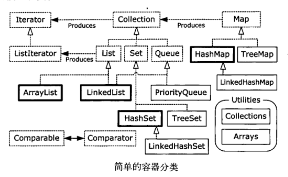

 保存对象可以使用数组，但限制是数组的尺寸是固定的。另一种方法是使用容器类。例如，Set对于每一个值都只保存一个对象，Map允许保存键值对（key-value）。Java容器类都可以自动调整自己的尺寸。

<!--more-->

### 1、泛型和类型安全的容器

例如，如果想要定义一个用来保存Apple对象的ArrayList，你可以声明ArrayList\<Apple\>，其中尖括号括起来的是类型参数，它指定了这个容器实例可以保存的类型。通过使用泛型，就可以在编译期防止将错误类型的对象放置到这个容器中。向上转型也可以像作用于其他类型一样作用于泛型。例：

```java
import java.util.ArrayList;

class Apple{}
class Gala extends Apple{}
class Fuji extends Apple{}

public class GenericsAndUpcasting {
    public static void main(String[] args) {
        ArrayList<Apple> apples = new ArrayList<>();
        apples.add(new Apple());
        apples.add(new Gala());
        apples.add(new Fuji());
        for (Apple a:apples){
            System.out.println(a);
        }
        /*另一种遍历方法
        for (int i = 0; i < apples.size(); i++){
            apples.get(i);
        }
        */
    }
}
```

### 2、基本概念

Java容器类的用途是“保存对象”，并将其划分为两个不同的概念：

（1）Collection。一个独立元素的队列，这些元素都服从一条或多条规则。List必须按照插入的顺序保存元素，而Set不能有重复元素。Queue按照排队规则来确定对象的产生顺序（通常与它们被插入的顺序相同，Queue只允许从一端插入对象，从另一端移除对象）。

（2）Map。一组成对的“键值对”对象，允许你使用键来查找值。ArrayList允许你使用数字来查找值，在某种意义上讲，它将数字与对象关联在了一起。映射表允许我们使用另一个对象来查找某个对象，它也被称为“关联数组”或“字典”。

在理想情况下，你编写的大部分代码都是在和这些接口打交道，并且你唯一需要指定所使用的精确类型的地方就是在创建的时候。因此，你可以像下面这样创建一个List：

```java
List<Apple> apples = new ArrayList<Apple>();
```

注意，ArrayList已经被向上转型为List，使用接口的目的在于如果你决定去修改你的实现（List的实现），你所需的只是在创建处修改它，像下面这样：

``` java
List<Apple> apples = new LinkedList<Apple>();
```

因此，你应该创建一个具体类的对象，将其转型为对应的接口，然后在其余的代码中都使用这个接口。

### 3、添加一组元素

在java.util包中的Arrays和Collections类中有很多实用的方法，可以在一个Collection中添加一组元素，Arrays.asList()方法接受一个数组或是一个用逗号分割的元素列表（使用可变参数），并将其转换为一个List对象。 Collection.addAll()方法接受一个Collection对象，以及一个数组或一个用逗号分割的列表，将元素添加到Collection中。例：

``` java
import java.util.*;

public class AddingGroups {
    public static void main(String[] args) {
        Collection<Integer> collection = new ArrayList<Integer>(Arrays.asList(1,2,3,4,5));
        Integer[] moreInts = {6,7,8,9,10};
        collection.addAll(Arrays.asList(moreInts));
        Collections.addAll(collection,moreInts);
        Collections.addAll(collection,11,12,14,15);
        List<Integer> list = Arrays.asList(16,17,18,19,20);
        list.set(1,99); //Ok--modify an element
        //list.add(21);  //error
    }
}
```

你可以使用Arrays.asList()的输出，将其当做List，但在这种情况下，其底层表示的是数组，因此不能调整尺寸。

### 4、容器的打印

数组的打印可以使用Arrays.toString()方法，但打印容器无需任何帮助。例：

``` java
import java.util.*;

public class PrintingContainers {
    static Collection fill(Collection<String> collection){
        collection.add("rat");
        collection.add("cat");
        collection.add("dog");
        collection.add("dog");
        return collection;
    }
    static Map fill(Map<String,String> map){
        map.put("rat", "Fuzzy");
        map.put("cat", "Rags");
        map.put("dog", "Bosco");
        map.put("dog", "Spot");
        return map;
    }

    public static void main(String[] args) {
        String[] s = {"rat", "cat", "dog"};
        System.out.println(Arrays.toString(s));
        System.out.println(fill(new ArrayList<String>()));
        System.out.println(fill(new LinkedList<String>()));
        System.out.println(fill(new HashSet<String>()));
        System.out.println(fill(new TreeSet<String>()));
        System.out.println(fill(new LinkedHashSet<String>()));
        System.out.println(fill(new HashMap<String,String>()));
        System.out.println(fill(new TreeMap<String,String>()));
        System.out.println(fill(new LinkedHashMap<String,String>()));
    }
}
```

ArrayList和LinkedList都是List类型，两者不同之处在于执行某些操作时的性能。HashSet、TreeSet、LinkedHashSet都是set类型，HashSet是最快获取元素的方式，存储的顺序没有意义；TreeSet按照比较结果升序保存对象；LinkedHashSet按照添加的顺序保存对象。List和Set都是Collection类型。

Map.put(key,value) 方法将新增一个值，并将它与某个键（你用来查找这个值的对象）关联起来。Map.get(key)方法返回与这个键相关联的值。Map对每个键只保存一次。Map的三种基本风格：HashMap、TreeMap和LinkedHashMap。与HashSet一样，HashMap提供最快的查找技术，无顺序。TreeMap按照比较结果的升序保存键，LinkedHashMap按照插入的顺序保存键，同时保留HashMap的查询速度。

### 5、List

有两种类型的List：

ArrayList，擅长随机访问，但在list中间插入和移除元素较慢。因为ArrayList的底层是用数组实现的，数组保存在连续的内存空间，插入和删除中间元素时要一个个移动后面的元素，所以比较慢。

LinkedList，通过较低代价在List中间进行插入和删除操作，提供了优化的顺序访问，但在随机访问方面较慢。因为LinkedList底层是链表实现的，链表保存在不连续的内存空间，通过指针链接，插入和删除时只需要修改前后元素指针的值就可以，所以比较快。

### 6、迭代器

迭代器（也是一种设计模式）是一个对象，它的工作是遍历并选择序列中的对象，而客户端程序员不必知道序列底层的结构。此外，迭代器通常被称为轻量级对象：创建它的代价小。

```java
import java.util.ArrayList;
import java.util.Arrays;
import java.util.Iterator;
import java.util.List;

public class IteratorTest implements Iterable { //实现Iterable接口，说明这个类是可迭代的
    private List<Integer> list = new ArrayList<>();
    public IteratorTest(){}
    public IteratorTest(Integer[] list){    //允许通过一个数组初始化列表
        this.list = new ArrayList<Integer>(Arrays.asList(list));
    }
    public void add(int e){
        list.add(e);
    }
    @Override
    public Iterator iterator() {    //Iterable接口的方法，返回一个迭代器
        return new Iterator() { //匿名内部类实现Iterator接口，返回一个自定义的迭代器
            private int i = 0;  //列表索引
            @Override
            public boolean hasNext() {
                return i < list.size();
            }
            @Override
            public Object next() {
                return list.get(i++);
            }
        };
    }

    public static void main(String[] args) {
        IteratorTest it = new IteratorTest(new Integer[]{1, 2, 3, 4, 5});
        Iterator iter = it.iterator();
        while (iter.hasNext()) { 	//也可以用foreach语法遍历实现了Iterable接口的类
            System.out.println(iter.next());
        }
    }
}
```

迭代器使用next()获得序列中的下一个元素，使用hasNext()检查序列中是否还有元素。如果只是向前遍历序列，并不打算修改序列对象本身，那么使用foreach语法更加简洁。

ListIterator是一个更加强大的Iterator的子类型，它只能用于各种List类的访问。Iterator只能单向移动，ListIterator可以双向移动。

### 7、LinkedList

LinkedList添加了可以使其用作栈、队列或双端队列的方法。 具体可以查看jdk文档。

### 8、Stack

栈通常是指后进先出的容器，因为最后压入的元素，第一个弹出栈。LinkedList具有能够直接实现栈的所有功能的方法，因此可以直接将LinkedList作为栈使用。不过，有时候一个真正的“栈”更能把事情讲清楚。

``` java
import java.util.LinkedList;

public class MyStack<T> {
    private LinkedList<T> storage = new LinkedList<T>();
    public void push(T v){storage.addFirst(v);}	//压入一个对象
    public T peek(){return storage.getFirst();}	//返回栈顶元素
    public T pop(){return storage.removeFirst();}	//移除并返回栈顶元素
    public boolean empty(){return storage.isEmpty();}
    public String toString(){return storage.toString();}
}
```

### 9、Set

Set不保存重复的元素，因此所有元素在set里面只出现一次。Set具有与Collection完全一样的接口，实际上Set就是Collection，只是行为不同。TreeSet将元素存储在红黑树数据结构中，而HashSet使用的是散列函数。LinkedHashSet因为查询速度原因也使用了散列，但是它使用了链表来维护元素的插入顺序。

### 10、Map

Map具有将对象映射到其他对象的能力。Map与数组和其他的Collection一样，可以很容易地扩展到多维，因此，我们可以将容器组合起来从而快速的生成强大的数据结构，例Map<Person,List\<Pet>>

### 11、Queue

队列是一个先进先出的容器，即从一端放入事物，从另一端取出，LinkedList提供了方法以支持队列的行为，并且它实现了Queue接口，因此LinkedList可以用做Queue的一种实现。

优先级队列声明下一个弹出的元素是最需要的元素（具有最高优先级）。当你在PriorityQueue上调用offer()方法来插入一个对象时，这个对象会在队列中被排序，默认的排序将使用对象在队列中的自然顺序，但你可以通过提供自己的Comparator来修改这个顺序。PriorityQueue可以确保当你调用peek()、poll()和remove()方法时，获取的元素是队列中优先级最高的元素。

### 总结

