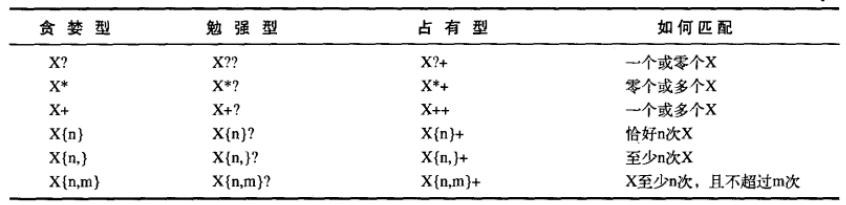

#  量词

量词描述了一个模式吸收输入文本的方式。

<!--more-->

有以下三种：




```java
public class Main
{
	public static void main(String[] args)
	{
		String str="<aaa<bbb>ccc<ddd>eee>";
		System.out.println(str.replaceAll("<.+>","####"));
		System.out.println(str.replaceAll("<.+?>","####"));
		System.out.println(str.replaceAll("<.++>","####"));
		System.out.println(str.replaceAll("<d++>","####"));
	}
}
/* output:
####
####ccc####eee>
<aaa<bbb>ccc<ddd>eee>
<aaa<bbb>ccc####eee>
*/
```

下面说明：

贪婪型最好说明即让.+尽可能匹配更多的字符。

勉强性是从左到右让.+尽可能匹配最少的字符，这里是第一个误区，并不是匹配最短的，而是从左向右查找过程中没遇到一个可以输出的结果就输出，所以上例中被匹配掉的是<aaa\<bbb>和\<ddd>   而不是\<bbb> \<ddd>。

对于占有型，它是在贪婪型的基础上不回溯，因为匹配过程是从左到右遍历，对于贪婪型和勉强型为了获得符合要求的结果都要保存很多的中间状态以便回溯。但是对于占有型，它不支持回溯，所以在第三个输出中字符串的第一个<和正则表达式的<匹配，而随后的所以字符串都和.+匹配，这个时候没有字符与>匹配，而对于第四个输出\<ddd>的第一个<与正则表达式的<匹配d++与中间的d匹配，>与>匹配，匹配成功。这是第二个误区，许多文章都没有把这个类型看透。

另外需要注意的是，所谓贪婪型、勉强性和占有型只是对于量词而言的并不是对于整个正则表达式。也就是说贪婪型匹配尽量多的字符，勉强性匹配尽量少的字符（从左向右），占有型匹配尽量多的字符并不支持回溯。


本文转载自https://blog.csdn.net/mushao999/article/details/46331145