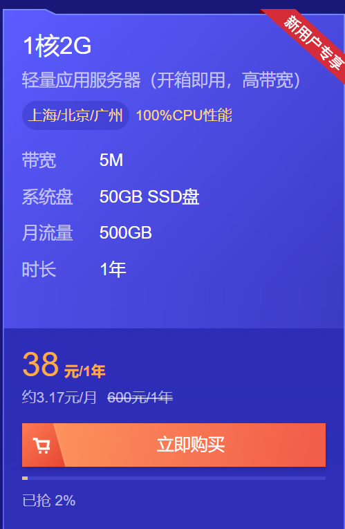

最近突然开始关注起服务器相关的信息，看得心里痒痒的，想着自己买一个服务器来玩玩。然后偶然在网上看到腾讯云的服务器一年才38元，真香！

**就是这个**>>>  [**【腾讯云】热门云产品首单特惠秒杀，1核2G云服务器首年38元**](https://cloud.tencent.com/act/cps/redirect?redirect=1077&cps_key=972e542d7f6d5c5aeadde1633739f7dd&from=console)

虽然配置是最低的，但是用来部署博客，跑几个小应用，也足够了。

然后昨天我就把它买下来了，经过两天的折腾，终于把自己的东西弄上去了。

第一个搭建的是[kodbox（可道云）](https://kodcloud.com/download/)，这是一个私人云盘，可以把文件/音乐/视频传上去，在浏览器直接预览/编辑/下载，这几个特点还是比较吸引我的。后面有空再出一个搭建教程，包括服务器（Linux）搭建，本地（Windows）搭建。

第二个搭建的是我的公众号的后端服务，这里面包括了一些springboot项目打包/运行、nginx配置、[服务器配置jdk环境](https://blog.csdn.net/pdsu161530247/article/details/81582980)相关的知识，后面有空再详细说一下。我在公众号里弄了一个聊天机器人，大家可以去体验一下，微信公众号搜索 **Zahi** 并关注就好了。

第三个就是把我的博客部署到服务器上了，主要参考了这个博客 【[带你跳过各种坑，一次性把 Hexo 博客部署到自己的服务器](https://blog.csdn.net/qq_35561857/article/details/81590953)】。不过由于域名没有备案，不能解析到自己的服务器上，所以现在的博客实际还是访问Github page。

以后会继续折腾这个服务器，把一些有趣或者有用的小玩意放上去~

