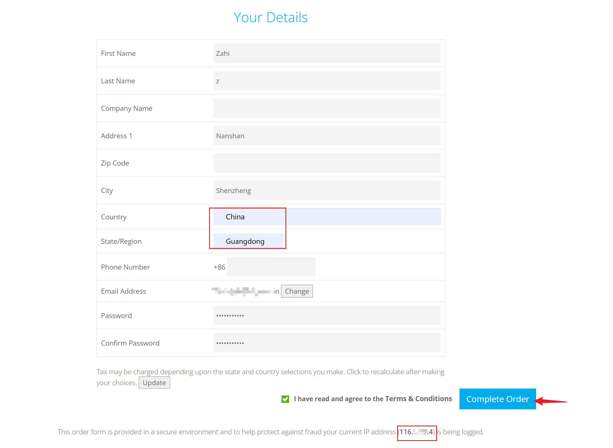
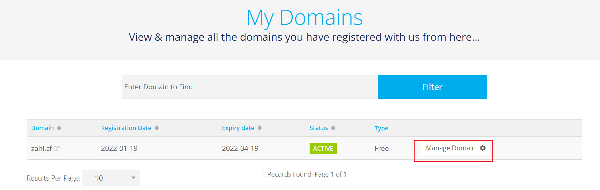
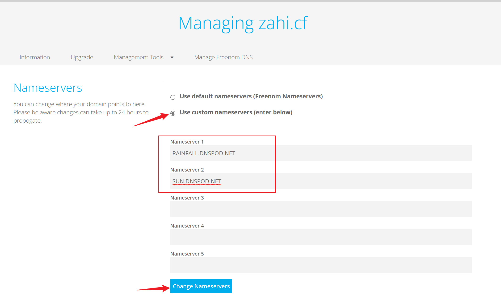
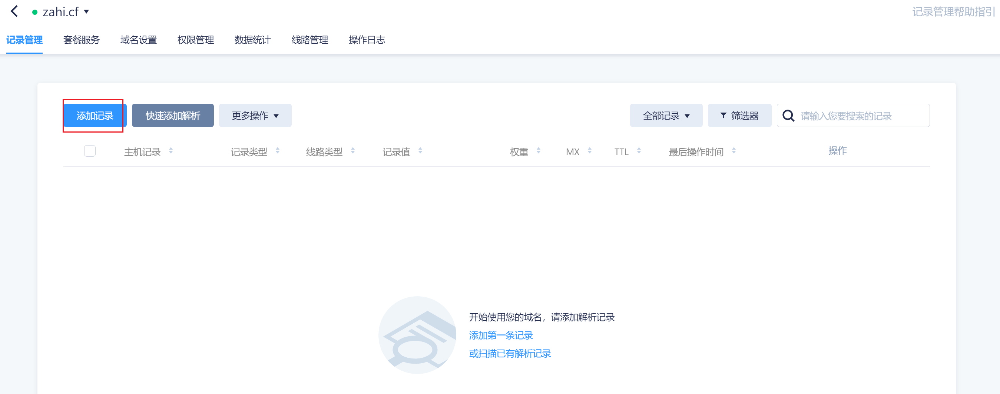
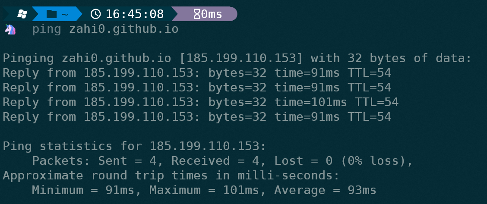

在Github Page上搭建完博客之后，发现博客的域名有点长，不是很满意，所以想着搞一个自己的域名。经过一番网上冲浪之后，发现可以在[Freenom](http://www.freenom.com/zh/index.html)上白嫖一个免费的顶级域名，freenom 提供了tk、ml、ga、cf、gq这几个后缀的免费域名。下面主要介绍 freenom 免费域名的申请过程及设置域名解析。

<!--more-->

# 0、安装浏览器插件

首先安装一个非常实用的浏览器插件，iGG谷歌学术助手（我的浏览器是Edge，其他浏览器同理）

使用它可以访问Google、Gmail等服务，而且装上它之后访问freenom官网的速度快了很多，其他的功能大家就自己探索吧。

添加这个插件之后会提示用邮箱登录，用QQ邮箱直接登录就行。

# 1、申请免费域名

访问[Freenom](https://www.freenom.com/zh/index.html?lang=zh)官网，输入自己想要的域名，点击检测可用性

选择免费的，点击现在获取

如果点击了之后显示不可用，可以直接带后缀搜索，这样会直接加入购物车

到下一个页面，选择12个月

点击Continue，进入如下页面

如果有谷歌或Facebook账号可以直接登录，这里我选择输入邮箱

然后会收到一个邮件，点击邮件里面的连接，填写如下信息，重点：国家和省份要和IP地址的归属地一致，复制下方的IP（这是你的外网IP）到[这个网站](https://www.ip138.com/)查询IP归属地

填完之后点击Complete Order，出现如下页面，说明申请成功了。

PS：如果这个页面有如下信息：`Attention! Some of your domains could not be registered because of a technical error. These domains have been cancelled` 说明域名注册失败，原因是国家/省份和IP地址归属地不匹配，到个人信息里面修改即可。

点击Services--My Domains查看自己的域名

# 2、DNS域名解析设置

点击Manage Domain

选择Nameservers

选择Use custom nameservers，填入下面两个地址，最后点击Change Nameservers

`RAINFALL.DNSPOD.NET`

`SUN.DNSPOD.NET`

上述操作的意思是，不使用freenom的默认DNS，而是授权给DNSpod来处理域名解析

进入[DNSPOD](https://www.dnspod.cn/login)，直接微信扫码登录

点击左侧 我的域名，然后添加域名

输入我们的域名后，点击确认

点击这个域名

添加记录

填写如下内容，点击确认

其中的IP地址来自  `ping 你的账号.github.io`

最后到项目里 settings-->Pages-->Custom domain 输入你的域名保存就好啦。

在浏览器输入你的域名，enjoy！
