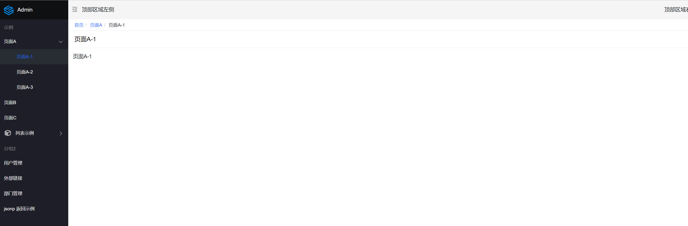

# 0、前言

作为一个后端打工人，我对前端是几乎完全不懂，当我想自己写一些项目玩的时候，前端怎么搞就成了一个难题。感觉前端的知识太多太杂，学起来很难，需要消耗比较多的时间精力。直到我发现了Amis，一个低代码前端框架，它使用 JSON 配置来生成页面，可以减少页面开发工作量，极大提升效率。对于前端小白的我来说，它就是一个神器啊，结合官方给出的demo，我们可以很快搭建出一个后台管理界面，基本上能满足我们日常的一些需求了。下面来说一下搭建过程。

# 1、下载sdk

先新建一个`amis-project`目录，然后把最新发布的sdk下载到这个目录。

sdk地址：[Releases · baidu/amis (github.com)](https://github.com/baidu/amis/releases)


把`jssdk.tar.gz`直接解压，得到`jssdk`目录，里面就是我们要用到的sdk了，顺手把`jssdk.tar.gz`删除。

# 2、下载amis-admin项目源码

amis-admin是一个官方demo，我们可以基于这个demo开发自己的项目。

项目地址：[aisuda/amis-admin: 基于 amis 的后台项目前端模板 (github.com)](https://github.com/aisuda/amis-admin)

直接下载zip压缩包，下载到任意位置然后解压，解压后得到如下文件。


我们只需要红框内的文件，其他的可以直接删除了，把红框内文件复制到`amis-project`目录下。最后，`amis-project`目录结构如下：


`page`是存放用于生成页面的json文件

`public`是存放一些图片之类的文件

`index.html`就是主页了，它会读取`page`目录下的文件渲染生成一个个页面。打开`index.html`修改一下sdk的路径，如下图：


# 3、配置Nginx

先到[Nginx官网](http://nginx.org/en/download.html)下载Windows版本，解压后打开conf目录，找到`nginx.conf`文件打开，加入如下配置：

```nginx
server {
        listen       7000;
        server_name  localhost;
        location / {
            root   D:/amis-project;
            index  index.html;
        }
    }
```

然后启动nginx，浏览器输入http://localhost:7000/，就可以看到页面了。



# 4、结语

把项目搭建起来之后，后续要做的就是对照着页面和代码，修改成自己想要样子了。开始前先看看[官方文档](https://aisuda.bce.baidu.com/amis/zh-CN/docs/index)，设计页面可以使用[amis 可视化编辑器](http://aisuda.github.io/amis-editor-demo)。

