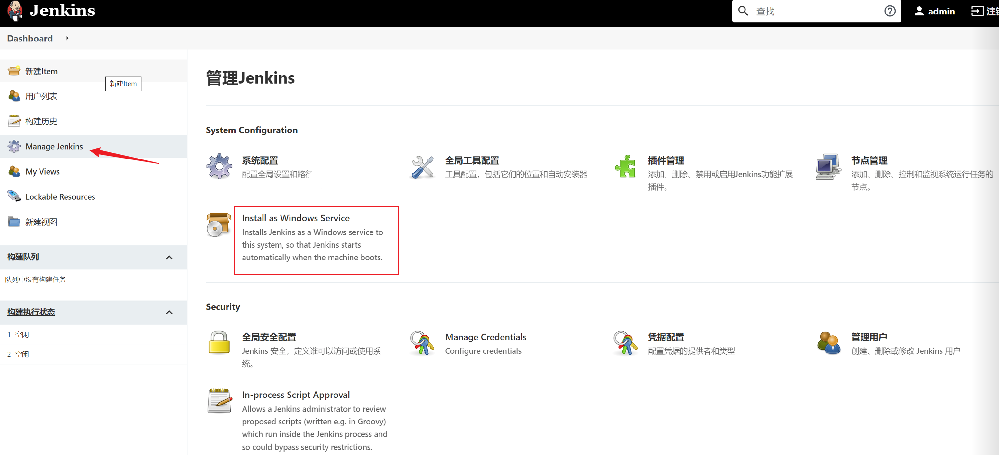
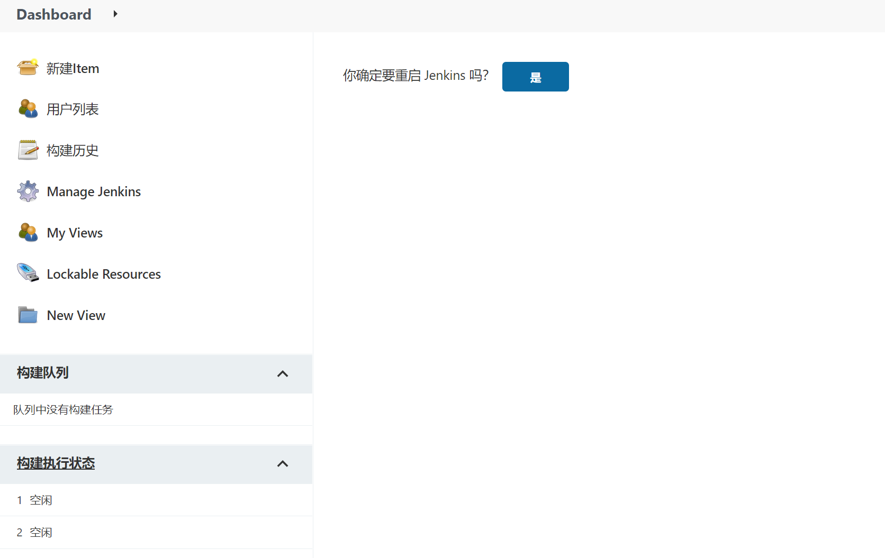

# 1、启动 Jenkins

一般在启动的时候指定它的端口号

```sh
java -jar jenkins.war --httpPort=8080
```

然后就可以通过 http://localhost:8080/ 去访问它了。

# 2、关闭 Jenkins

可以通过URL的方式关闭它，浏览器输入

 http://localhost:8080/exit

出现如下页面，点击使用POST重试，然后 Jenkins 就关闭了


<br>

# 3、重启 Jenkins

如果是 Windows 用户，需要先在首页 ----> Manage Jenkins ----> Install as Windows service( 设置为Windows服务 ) ，点击安装即可，否则重启会报错 *Jenkins cannot restart itself as currently configured.*



<br>

在浏览器输入以下链接即可重启

http://localhost:8080/restart




# 4、重载 Jenkins 配置信息

浏览器输入：

http://localhost:8080/reload

# 5、常见问题

昨天直接在任务管理器把 Jenkins 关掉后，再次打开，发现自己的项目不见了😭坑啊，找了一圈方法，没有适合我的，只能重新配一次了。所以一定要用正确的方法关闭Jenkins，不然会出现不可预料的问题。
