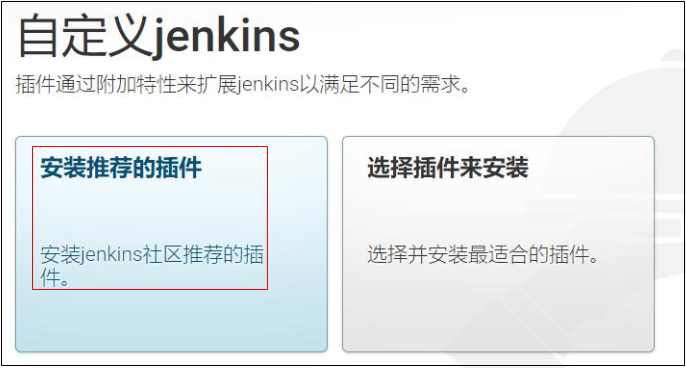
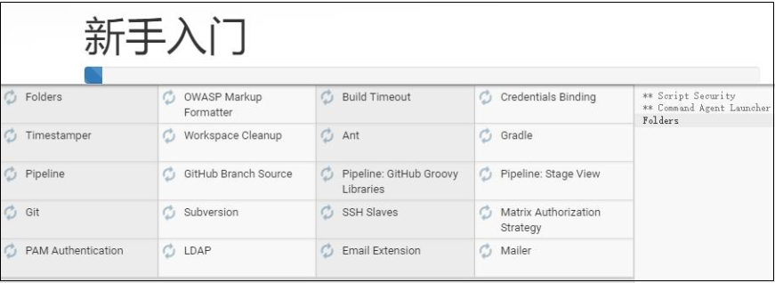
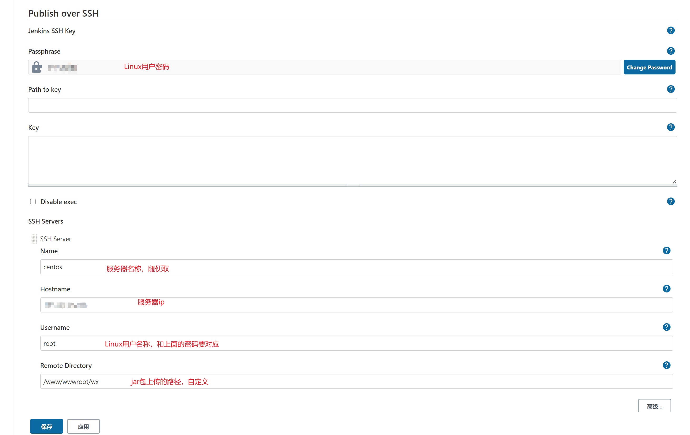
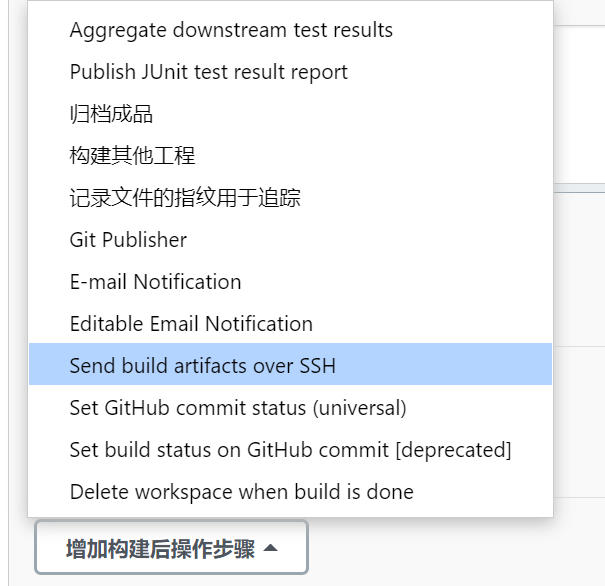
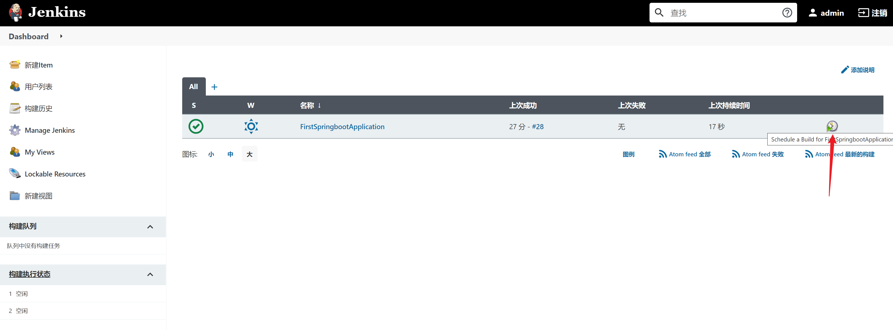

# 0、简介

Jenkins是一个开源的、提供友好操作界面的持续集成(CI)工具，主要用于持续、自动的构建/测试软件项目。Jenkins用Java语言编写，可在Tomcat等流行的servlet容器中运行，也可独立运行。通常与版本管理工具(SCM)、构建工具结合使用。常用的版本控制工具有SVN、GIT，构建工具有Maven、Ant、Gradle。

简而言之就是，**一键完成拉代码、编译、构建、部署等任务**。

# 1、安装

1.1 下载最新[安装包](http://mirrors.jenkins.io/war-stable/latest/jenkins.war)

<br>

1.2 打开安装包所在目录，运行命令 (前提是已经安装好jdk环境)

```sh
java -jar jenkins.war --httpPort=8080
```

<br>1.3 打开浏览器进入链接 [`http://localhost:8080`](http://localhost:8080/).

<br>

1.4 填写初始密码


<br>

1.5 安装推荐的插件





<br>

1.6 创建初始账户


<br>

1.7 进入系统


<br>

1.8 安装 **Publish Over SSH** 插件，在可选插件里搜索它并安装


<br>

1.9 配置服务器




<br>

1. 10 选择左侧栏的**新建Item**，然后输入任务名称，选择第一个**Freestyle project**，点击确定


<br>

1.11 由于我是在自己的电脑上装的Jenkins，代码也在本地，所以下面的操作会有所不同，使用git管理代码的可以看参考文章

<br>

1.12 进入项目配置页面后，前面的内容都不用管，直接拖到**构建**这一栏


<br>

1.13 点击**增加构建步骤**，由于我的电脑是Windows系统，所以选择**执行Windows批处理命令**


<br>

然后再增加一个构建步骤，把打包好的jar包复制到Jenkins的工作目录（C:\Users\username\\\.jenkins\workspace\任务名称\）

ps: 尝试过将这个命令也放在上面，但是没有执行，所以只能单独拿出来


<br>

1.14 点击增加构建后操作，选择下图所示选项（用ssh把jar包发送到服务器），填写红字标注的内容



<br>


<br>

1.15 启动脚本 **start.sh** 内容如下，放在服务器的 /www/wwwroot/wx 目录下

```sh
#!/bin/bash
#日期格式
date="[`date +"%Y-%m-%d_%H:%M:%S"`]  "
#script.log记录脚本执行日志
echo $date'---------start.sh----------' > script.log
#先查一下是否有正在运行的employee服务，获取它的进程id
pid=`ps -ef |grep employee.jar|grep -v grep|awk '{print $2}'`

echo $date'employee service pid:'$pid >> script.log

#如果进程id不为空，说明已经有服务在运行，先停掉
if [ -n "$pid" ]
then
echo $date"Stop service : employee.jar" >> script.log
kill -9 $pid
fi

echo $date'Start service : employee.jar' >> script.log
#启动服务，必须用jdk的全路径，后台运行服务，日志输出到employee.log
nohup /usr/local/jdk1.8.0_321/bin/java -jar employee.jar > employee.log &
#再次获取服务进程id
pid=`ps -ef |grep employee.jar|grep -v grep|awk '{print $2}'`
#如果进程id不为空，则服务启动成功
if [ -n "$pid" ]
then
echo $date'Start service success! pid:'$pid >> script.log
exit 0
else
echo $date'Start service fail!' >> script.log
exit 1
fi
```

<br>

1.16 配置完成，点击保存，回到首页，点击右边的按钮开始一次构建




# 2、参考文章

[Jenkins详细教程-jenkins安装与配置 - 不停学 - 博客园 (cnblogs.com)](https://www.cnblogs.com/butingxue/p/14068409.html)

