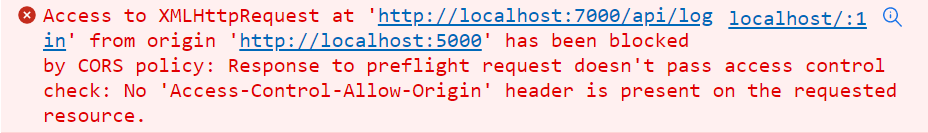
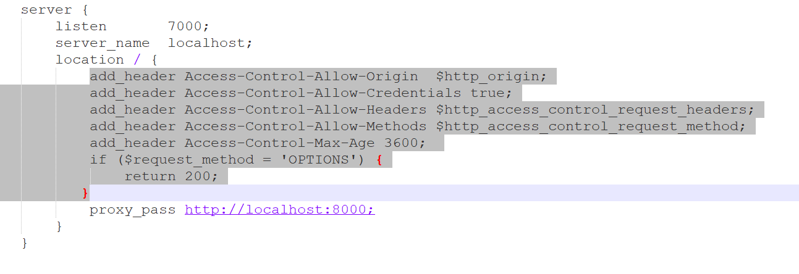
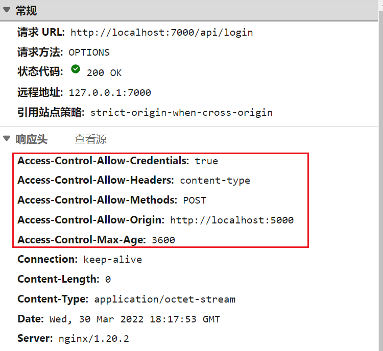

# 0、问题出现

事情是这样的，我在Nginx里配置了两个服务，一个监听5000端口，用来代理前端，一个监听7000端口，用来代理后端。


然而在前端调用后端接口时，浏览器报跨域错误


再看一下控制台：



# 1、什么是跨域

跨域是指a页面想获取b页面资源，如果a、b页面的协议、域名、端口、子域名不同，或是a页面为ip地址，b页面为域名地址，所进行的访问行动都是跨域的，而浏览器为了安全问题一般都限制了跨域访问，也就是不允许跨域请求资源。

跨域问题的根本原因：因为浏览器受到同源策略的限制，当前域名的js只能读取同域下的窗口属性。什么叫做同源策略？就是不同的域名, 不同端口, 不同的协议不允许共享资源的，保障浏览器安全。同源策略是针对浏览器设置的门槛。

只有访问类型为XHR（XMLHttpRequest)的才会出现跨域。XHR是基于XML的HTTP请求，XHR用于在后台与服务器交换数据。XHR是一个浏览器接口，使得Javascript可以进行HTTP(S)通信，ajax就是基于浏览器提供的XHR对象来实现的。ajax，可以实现异步的加载网页也就是说可以在不重新加载整个网页的情况下，对网页的某部分进行更新。浏览器端发送的请求只有XHR 或 fetch 发出的才是 ajax 请求, 其它所有的都是非 ajax 请求，ajax 请求是一种特别的 http 请求。当浏览器端接收到ajax 请求,浏览器不会对界面进行任何更新操作, 只是调用监视的回调函数并传入响应相关数据。

# 2、解决方案

在nginx中添加跨域配置，可以添加在server字段，应用于整个server，也可以添加在server:location字段下,应用于单个location。nginx配置文件通过使用add_header指令来设置响应头response header。当前层级无 add_header 指令时，则继承上一层级的add_header。相反的若当前层级有了add_header，就无法继承上一层的add_header。

```nginx
# 指定允许的请求域名端口访问我们的跨域资源，*代表所有的域，也可设置具体域名　　　　 
#　add_header Access-Control-Allow-Origin *;　　　　
#当带cookie访问时不能用*，带cookie的请求不支持*号。$http_origin表示动态获取请求客户端请求的域。　　　　　
add_header Access-Control-Allow-Origin $http_origin;　　　　　 

# 带cookie请求需要加上这个字段，并设置为true　　　　 
add_header Access-Control-Allow-Credentials true;
   　　　　 
# 指定允许跨域的方法，*代表所有方法，$http_access_control_request_method指动态获取，也可设置具体方法。　　　　 
# add_header Access-Control-Allow-Methods $http_access_control_request_method;　　　　 
#如设置GET,POST,OPTIONS三种方法        
add header Access-Control-Allow-Methods 'GET, POST, OPTIOS';　　
　　　　 
# 表示请求头的字段,*表示所有字段　　　　 
#add_header Access-Control-Allow-Headers *;　　　　 
#动态获取　　　　 
add_header Access-Control-Allow-Headers $http_access_control_request_headers;
　　　　 
# 预检命令的缓存，如果不缓存每次会发送两次请求 　　　　 
add_header Access-Control-Max-Age 3600; 

# OPTIONS预检命令，预检命令通过时才发送请求 　　　　 
# 检查请求的类型是不是预检命令 　　　　 
if ($request_method = OPTIONS){　　　　　　 
	return 200; 　　　　
}
```

根据上述方案，我在后端服务加上如下配置：



修改完后，nginx重新加载配置，问题就解决啦

```shell
nginx -s reload
```

<br>

<br>

当然，如果你的后端不用Nginx代理，前端直接访问后端的话，还可以用这种方法：

Springboot项目，添加一个配置类

```java
import org.springframework.context.annotation.Configuration;
import org.springframework.web.servlet.config.annotation.CorsRegistry;
import org.springframework.web.servlet.config.annotation.WebMvcConfigurerAdapter;

@Configuration
public class WebMvcConfig extends WebMvcConfigurerAdapter {
    
    /**
     * 解决前端跨域问题
     * @date 2022/3/28
     * @return void
     */
    @Override
    public void addCorsMappings(CorsRegistry registry) {
        registry.addMapping("/**")
                .allowedOrigins("*")
                .allowedMethods("POST", "GET", "PUT", "OPTIONS", "DELETE")
                .maxAge(3600)
                .allowCredentials(true);
    }
}
```

<br>

其他语言的思路也差不多，就是在响应返回给浏览器之前，在response header里加上那几个参数就好了。
浏览器看到服务器返回的响应头里面有这几个参数，就不会报跨域的异常了



# 3、其他问题

（1）加了上面的Nginx配置还有跨域问题，http状态码是4XX或5XX。

经百度发现，Nginx **add_header** 只对2XX，3XX 这些状态码生效，对于4XX，5XX这些状态码是不生效的。

**解决办法:**`添加: always`

```nginx
add_header Access-Control-Allow-Origin  $http_origin always;
add_header Access-Control-Allow-Credentials true always;
```

这两个配置后面加上always就解决了。
