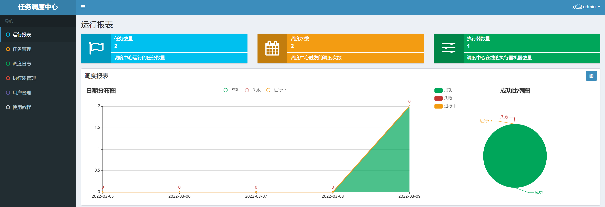
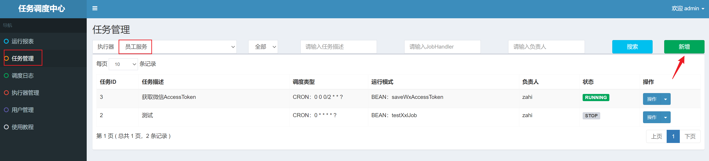
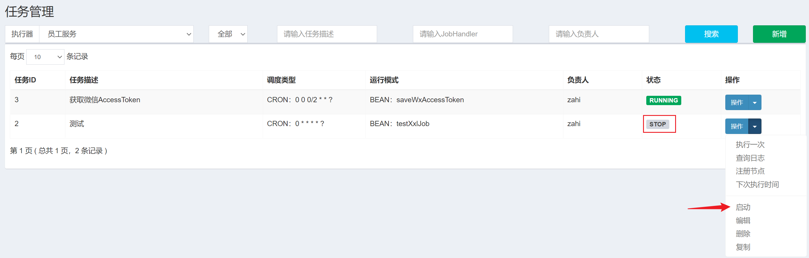
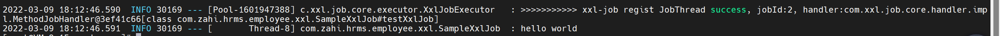
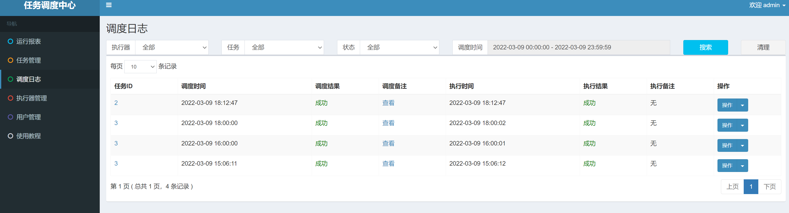

# 0、前言

大家平时在工作中应该经常用到定时任务，可能使用过Quartz框架或者Spring自带@Scheduled注解来实现定时任务，今天来介绍一个更加简单好用、功能强大的定时任务框架：xxl-job。xxl-job提供了一个管理界面，可以对定时任务进行增删改查、手动执行，还可以查看每一次的执行日志，支持集群部署，支持调度策略。下面简单介绍一下Springboot集成xxl-job的过程，更加详细的玩法请看官方文档。

# 1、下载

#### 文档地址

- [中文文档](https://www.xuxueli.com/xxl-job/)

| 源码仓库地址                         | Release Download                                          |
| :----------------------------------- | :-------------------------------------------------------- |
| https://github.com/xuxueli/xxl-job   | [Download](https://github.com/xuxueli/xxl-job/releases)   |
| http://gitee.com/xuxueli0323/xxl-job | [Download](http://gitee.com/xuxueli0323/xxl-job/releases) |

#### Maven

```xml
<!-- https://mvnrepository.com/artifact/com.xuxueli/xxl-job-core -->
<dependency>
    <groupId>com.xuxueli</groupId>
    <artifactId>xxl-job-core</artifactId>
    <version>2.3.0</version>
</dependency>
```

# 2、环境

- Maven3+

- Jdk1.8+

- Mysql5.7+

  

# 3、部署调度中心

## 3.1 获取源码

下载项目源码并解压，得到的目录结构为

```
xxl-job-2.3.0:
	doc: 官方文档和数据库sql
    xxl-job-admin：调度中心
    xxl-job-core：公共依赖
    xxl-job-executor-samples：执行器Sample示例（选择合适的版本执行器，可直接使用，也可以参考其并将现有项目改造成执行器）
        ：xxl-job-executor-sample-springboot：Springboot版本，通过Springboot管理执行器，推荐这种方式；
        ：xxl-job-executor-sample-frameless：无框架版本；
```


## 3.2 初始化“调度数据库”

执行以下sql:

```
/doc/db/tables_xxl_job.sql
```

## 3.3 配置调度中心

```
调度中心项目：xxl-job-admin
作用：统一管理任务调度平台上调度任务，负责触发调度执行，并且提供任务管理平台。
```

调度中心配置文件地址：

    /xxl-job-admin/src/main/resources/application.properties


调度中心主要配置内容说明：

    ### web
    server.port=8080
    server.servlet.context-path=/xxl-job-admin
    
    ### 调度中心JDBC链接
    spring.datasource.url=jdbc:mysql://127.0.0.1:3306/xxl_job?useUnicode=true&characterEncoding=UTF-8&autoReconnect=true&serverTimezone=Asia/Shanghai
    spring.datasource.username=root
    spring.datasource.password=root_pwd
    spring.datasource.driver-class-name=com.mysql.jdbc.Driver
    
    ### 报警邮箱
    spring.mail.host=smtp.qq.com
    spring.mail.port=25
    spring.mail.username=xxx@qq.com
    spring.mail.password=xxx
    spring.mail.properties.mail.smtp.auth=true
    spring.mail.properties.mail.smtp.starttls.enable=true
    spring.mail.properties.mail.smtp.starttls.required=true
    spring.mail.properties.mail.smtp.socketFactory.class=javax.net.ssl.SSLSocketFactory
    
    ### 调度中心通讯TOKEN [选填]：非空时启用；
    xxl.job.accessToken=
    
    ### 调度中心国际化配置 [必填]： 默认为 "zh_CN"/中文简体, 可选范围为 "zh_CN"/中文简体, "zh_TC"/中文繁体 and "en"/英文；
    xxl.job.i18n=zh_CN
    
    ## 调度线程池最大线程配置【必填】
    xxl.job.triggerpool.fast.max=200
    xxl.job.triggerpool.slow.max=100
    
    ### 调度中心日志表数据保存天数 [必填]：过期日志自动清理；限制大于等于7时生效，否则, 如-1，关闭自动清理功能；
    xxl.job.logretentiondays=30

**对我来说，只要配置一下服务端口、JDBC链接、数据库用户名密码就好了，其他的不用改。**

<br>

## 3.4 编译部署调度中心

执行以下命令

```
cd xxl-job-admin
mvn clean package
cd target
java -jar xxl-job-admin-2.3.0.jar
```

服务起来后，访问调度中心地址：http://localhost:8080/xxl-job-admin (该地址执行器将会使用到，作为回调地址)

默认登录账号 “admin/123456”, 登录后运行界面如下图所示。



至此“调度中心”项目已经部署成功。


# 4、部署“执行器”

```
“执行器”项目：xxl-job-executor-sample-springboot (提供多种版本执行器供选择，现以 springboot 版本为例，可直接使用，也可以参考其并将现有项目改造成执行器)
作用：负责接收“调度中心”的调度并执行；可直接部署执行器，也可以将执行器集成到现有业务项目中。
```

这里我没有用这个样例项目，而是直接改造原有的项目。

## 4.1 引入maven依赖

确认pom文件中引入了 "xxl-job-core" 的maven依赖；

## 4.2 执行器的配置

执行器配置，配置文件地址：

    /xxl-job-executor-samples/xxl-job-executor-sample-springboot/src/main/resources/application.properties

执行器配置，主要配置内容说明：

    ### 调度中心部署跟地址 [选填]：如调度中心集群部署存在多个地址则用逗号分隔。执行器将会使用该地址进行"执行器心跳注册"和"任务结果回调"；为空则关闭自动注册；
    xxl.job.admin.addresses=http://127.0.0.1:8080/xxl-job-admin
    
    ### 执行器通讯TOKEN [选填]：非空时启用；
    xxl.job.accessToken=
    
    ### 执行器AppName [选填]：执行器心跳注册分组依据；为空则关闭自动注册
    xxl.job.executor.appname=xxl-job-executor-sample
    ### 执行器注册 [选填]：优先使用该配置作为注册地址，为空时使用内嵌服务 ”IP:PORT“ 作为注册地址。从而更灵活的支持容器类型执行器动态IP和动态映射端口问题。
    xxl.job.executor.address=
    ### 执行器IP [选填]：默认为空表示自动获取IP，多网卡时可手动设置指定IP，该IP不会绑定Host仅作为通讯实用；地址信息用于 "执行器注册" 和 "调度中心请求并触发任务"；
    xxl.job.executor.ip=
    ### 执行器端口号 [选填]：小于等于0则自动获取；默认端口为9999，单机部署多个执行器时，注意要配置不同执行器端口；
    xxl.job.executor.port=9999
    ### 执行器运行日志文件存储磁盘路径 [选填] ：需要对该路径拥有读写权限；为空则使用默认路径；
    xxl.job.executor.logpath=/data/applogs/xxl-job/jobhandler
    ### 执行器日志文件保存天数 [选填] ： 过期日志自动清理, 限制值大于等于3时生效; 否则, 如-1, 关闭自动清理功能；
    xxl.job.executor.logretentiondays=30

**因为我的项目使用的是yml文件的配置，所以配置如下内容就好了**

```yaml
xxl:
  job:
    admin:
      addresses: http://localhost:8080/xxl-job-admin #填上调度中心地址，就可以自动注册
    accessToken:
    executor:
      appname: xxl-job-executor-emp #执行器名称也填上
      address:
      ip:
      port: 8002	#端口也填上，防止端口冲突
      logpath: /log/xxl-job/jobhandler	#日志路径建议填上，方便自己查日志
      logretentiondays: 30
```

## 4.3 执行器组件

新建一个类 `XxlJobConfig`

```
import com.xxl.job.core.executor.impl.XxlJobSpringExecutor;
import org.slf4j.Logger;
import org.slf4j.LoggerFactory;
import org.springframework.beans.factory.annotation.Value;
import org.springframework.context.annotation.Bean;
import org.springframework.context.annotation.Configuration;

@Configuration
public class XxlJobConfig {

    private Logger logger = LoggerFactory.getLogger(XxlJobConfig.class);

    @Value("${xxl.job.admin.addresses}")
    private String adminAddresses;

    @Value("${xxl.job.accessToken}")
    private String accessToken;

    @Value("${xxl.job.executor.appname}")
    private String appname;

    @Value("${xxl.job.executor.address}")
    private String address;

    @Value("${xxl.job.executor.ip}")
    private String ip;

    @Value("${xxl.job.executor.port}")
    private int port;

    @Value("${xxl.job.executor.logpath}")
    private String logPath;

    @Value("${xxl.job.executor.logretentiondays}")
    private int logRetentionDays;

    @Bean
    public XxlJobSpringExecutor xxlJobExecutor() {
        logger.info(">>>>>>>>>>> xxl-job config init.");
        XxlJobSpringExecutor xxlJobSpringExecutor = new XxlJobSpringExecutor();
        xxlJobSpringExecutor.setAdminAddresses(adminAddresses);
        xxlJobSpringExecutor.setAppname(appname);
        xxlJobSpringExecutor.setAddress(address);
        xxlJobSpringExecutor.setIp(ip);
        xxlJobSpringExecutor.setPort(port);
        xxlJobSpringExecutor.setAccessToken(accessToken);
        xxlJobSpringExecutor.setLogPath(logPath);
        xxlJobSpringExecutor.setLogRetentionDays(logRetentionDays);
        return xxlJobSpringExecutor;
    }
}
```

## 4.4 开发第一个定时任务“Hello World” 

新建一个类 `SampleXxlJob`

```
import com.xxl.job.core.handler.annotation.XxlJob;
import org.slf4j.Logger;
import org.slf4j.LoggerFactory;
import org.springframework.stereotype.Component;

@Component
public class SampleXxlJob {
    private static Logger logger = LoggerFactory.getLogger(SampleXxlJob.class);

    /**
     * 1、简单任务示例（Bean模式）
     */
    @XxlJob("testXxlJob")
    public void testXxlJob(){
        logger.info("hello world");
    }
}
```

## 4.5 部署执行器项目

可以直接在idea上运行，也可以打包部署到服务器上。

访问调度中心地址：http://localhost:8080/xxl-job-admin

点击“**执行器管理**”，再点击“**新增**”


AppName：填写前面yml文件里配置的AppName，

名称：随便填

注册方式：自动注册（前面yml文件配置了调度中心的地址，所以可以自动注册）

机器地址：不需要填


点击保存，稍等一会，Online机器地址就会出现一个数字，点击查看，就是你的执行器的地址，说明执行器已经注册到调度中心了。


## 4.6 在调度中心新增任务

点击 **任务管理** ，执行器选择刚才新增的执行器，再点击新增。



填写如下信息，JobHandler填写 **@XxlJob** 注解里面的内容。高级配置按需要填写，也可按默认配置。填完后点击保存。


刚新增的任务是停止状态，要点击启动，到了时间才会执行任务。



也可以点击**执行一次**马上执行任务，任务参数和机器地址不用填，直接点保存




点击左边的**调度日志**（这里需要点击任务id才能知道是哪个任务，我觉得这个体验不是很好哈）




<br>

最后，本文只是一个入门指引，其他高级玩法去翻官方文档哈。

END
