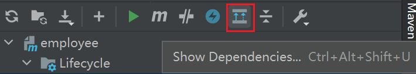

Maven项目构建过程中，主要构建命令有几种：


下面介绍一下每个命令的作用：

<br>

```
mvn clean
```

 清理，清理项目缓存输出，一般是target文件夹被删除；

<br>

```
mvn validate
```

 验证，验证项目是正确的并且所有的信息是可用的；

<br>

```
mvn compile
```

 编译，将java源文件编译成.class文件；

<br>

```
mvn test
```

 测试，生成测试报告，运行test目录下的所有单元测试；

<br>

```
mvn package
```

 打包，将项目打成jar、war或者pom；

<br>

PS：可以使用以下命令在打包时跳过测试

```
mvn package -Dmaven.test.skip=true
```

 或者直接在pom文件里添加

```
<skipTests>true</skipTests>
```


<br>

```
mvn verify
```

运行任何检查，验证包是否有效且达到质量标准。 

<br>

```
mvn install
```

 安装，将打好的包复制到本地maven库，供其他项目依赖；

<br>

```
mvn site
```

生成项目的站点文档

<br>

```
mvn deploy
```

部署，将打好的包复制到本地maven库和远程maven库。

<br>

tips1：以树的结构展示项目中的依赖

```
mvn dependency:tree
```

或者在idea里面点击这个图标



<br>

tips2：打包的时候同时打包源码

```
<build>
        <plugins>
            <plugin>
                <groupId>org.apache.maven.plugins</groupId>
                <artifactId>maven-compiler-plugin</artifactId>
                <version>3.6.0</version>
                <configuration>
                    <source>1.8</source> <!-- 源代码使用jdk1.8支持的特性 -->
                    <target>1.8</target> <!-- 使用jvm1.8编译目标代码 -->
                    <compilerArgs> <!-- 传递参数 -->
                        <arg>-parameters</arg>
                        <arg>-Xlint:unchecked</arg>
                        <arg>-Xlint:deprecation </arg>
                    </compilerArgs>
                </configuration>
            </plugin>
            <!-- 以下配置可以打包源码 -->
            <plugin>
                <groupId>org.apache.maven.plugins</groupId>
                <artifactId>maven-source-plugin</artifactId>
                <version>3.2.0</version>
                <executions>
                    <execution>
                        <id>attach-sources</id>
                        <phase>verify</phase>
                        <goals>
                            <goal>jar-no-fork</goal>
                        </goals>
                    </execution>
                </executions>
            </plugin>
        </plugins>
</build>
```


