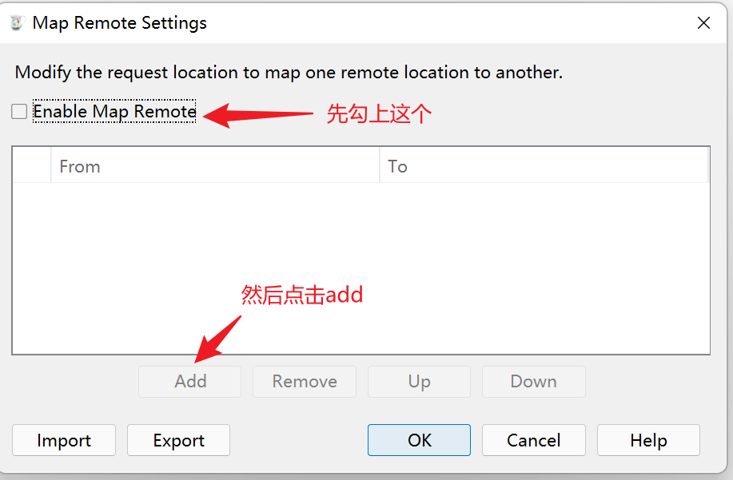

# 0、前言

平时我们在工作中可能经常会遇到这种情况，在测试环境我们的一个接口出问题了，但是没办法看日志（比如elk查不到日志啦，或者没权限登录服务器查看啦，又或者应用部署了很多台机器，不知道看那台机器的日志啦。。。），这种时候我们一般会想在自己的电脑上复现一下，看看报什么错。当你在本地启动应用，打开Postman准备调一下本地接口的时候，另一个问题出现了，这接口参数也太多了吧，一个个输太麻烦了！！！这时候就可以用Charles来解决问题了，Charles是一个抓包工具，经过简单配置就可以把浏览器的网络请求转发到我们本地的应用。

# 1、安装

打开[官网](https://www.charlesproxy.com/download/)下载并安装Charles

# 2、激活

打开[这个网站](https://www.zzzmode.com/mytools/charles/)

 

随便输入一个名称，点击生成。

 

复制好激活码，打开Charles，点击 Help --> Register Charles

 

然后输入刚才的名称和激活码

 

激活成功，点击确定，然后重新打开Charles

# 3、Map Remote

使用Charles的Map Remote功能就可以实现把网络请求转发到本地了。点击 Tools --> Map Remote

 

然后按下图所示操作

 

设置完成后，点击ok

 

到浏览器测试一下，成功。`zahi.cf/emp/1`被转发到本地的 `127.0.0.1:8000/emp/1` 

# 4、结语

经过这样配置之后，我们就可以在前端正常操作，前端原本要发给服务器的请求会被Charles转发到本地的应用，后端就可以获取所有参数，复现问题，这样就不需要用Postman自己组装参数，也不需要找前端联调了（万一被打）。
