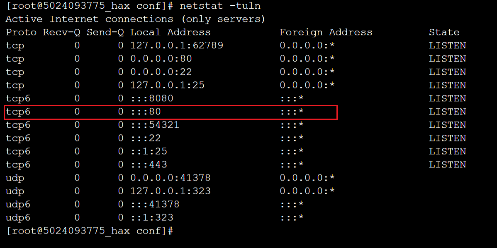
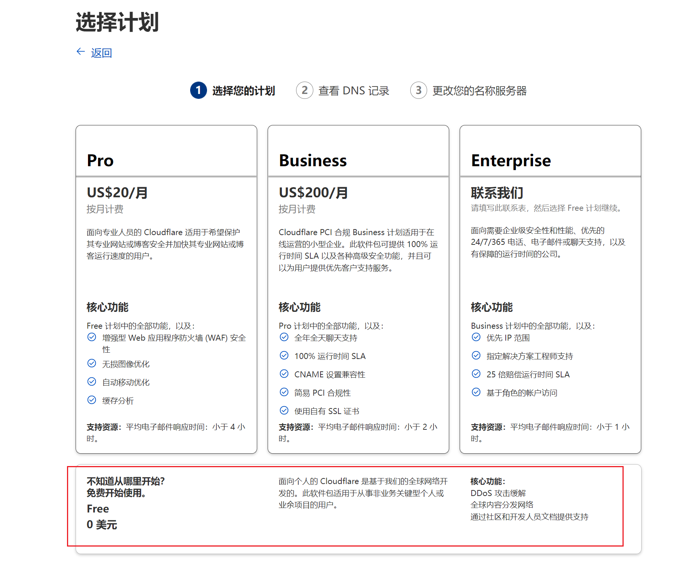
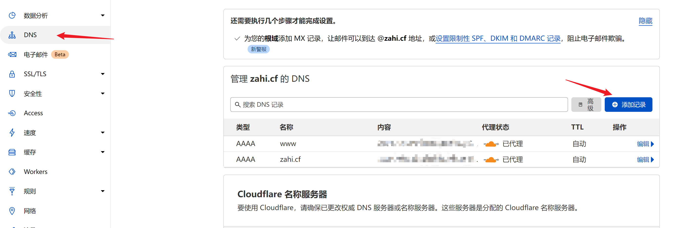
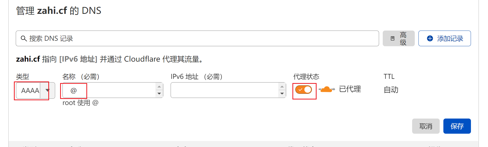
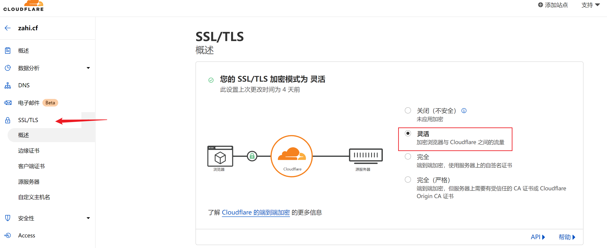
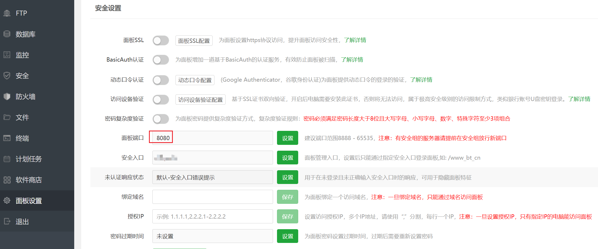

# 0、前言

前段时间搞了个[Hax](https://hax.co.id/home/)的免费服务器，1核450M内存5G硬盘，申请过程可以百度一下，非常简单。不过这个服务器是纯ipv6的，没有ipv4地址。我之前在Freenom上申请了两个域名（[申请方法看这篇文章](/2022/01/19/申请免费域名并绑定到Github-Page/)），但是没有在国内备案，不能解析到我那台腾讯云的服务器，所以想着把域名解析到Hax的服务器上玩玩。但是因为这个没有ipv4地址，而我的网络又不支持ipv6，所以想要在上面建站需要费一番功夫，研究了好几天终于弄明白，下面说一下大概过程。

# 1、安装warp

ssh登录机器，执行以下命令

```shell
wget -N https://cdn.jsdelivr.net/gh/fscarmen/warp/menu.sh && bash menu.sh
```

这样我们的机器就有了访问ipv4的能力

# 2、(可选)安装宝塔面板

执行以下命令

```shell
yum install -y wget && wget -O install.sh http://download.bt.cn/install/install_6.0.sh && sh install.sh
```

# 3、安装nginx

在宝塔面板里面安装。


PS：如果不想安装宝塔面板，也可以直接安装nginx，参考教程[Linux nginx安装篇](https://www.cnblogs.com/chinaWu/p/14035181.html)

# 4、监听ipv6

最新版的nginx已经默认支持ipv6，不需要重新编译ipv6模块，所以只需要在配置文件里加入ipv6监听就可以了

```
listen [::]:80 ipv6only=on;
```


保存后重载配置

```shell
service nginx reload
```

检测监听是否已经成功

```shell
netstat -tuln
```



# 5、使用Cloudflare解析域名

Cloudflare有免费的CDN和DNS服务，非常良心，而且用它代理ipv6服务器后，我们在ipv4的环境也可以访问服务器，这就很方便了。

先注册一个Cloudflare账号，访问[dash.cloudflare.com](http://dash.cloudflare.com/)登录后点击添加站点，选择免费计划，之后按照页面提示操作。



把域名托管到Cloudflare之后。点击DNS，添加记录，类型为AAAA，名称填@，然后输入服务器的ipv6地址，勾上代理状态，保存。





然后将SSL/TLS加密方式设置为灵活




然后浏览器访问你的域名就可以啦。

# 6、CloudFlare支持的端口

使用CloudFlare的代理不仅支持常规的80和443端口，还支持以下端口

```
HTTP ports supported by Cloudflare:
80
8080
8880
2052
2082
2086
2095
HTTPS ports supported by Cloudflare:
443
2053
2083
2087
2096
8443
```

比如，修改宝塔的面板端口为8080



然后勾上监听ipv6


就可以使用 `http://域名:8080`访问我们的宝塔面板啦。
