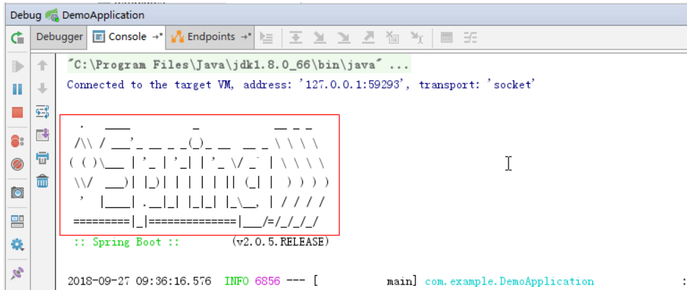

我们在启动Spring项目的时候，经常会看到下面这个玩意



<br>

其实这个也是可以改的，今天就来说一下怎么自定义这个banner

<br>

首先，在项目的`resources`目录下新建一个`banner.txt`


<br>

然后去生成banner网站生成自己想要的banner，这里推荐几个好用的网站

[https://www.bootschool.net/ascii](https://www.bootschool.net/ascii)

[http://patorjk.com/software/taag](http://patorjk.com/software/taag)

[http://www.network-science.de/ascii](http://www.network-science.de/ascii)

<br>

还有这个，能把图片转换成文本，非常牛B

[https://www.degraeve.com/img2txt.php](https://www.degraeve.com/img2txt.php)


<br>

生成好banner后，把内容拷到banner.txt里面就好了

<br>

<br>

PS：还能通过一些属性来设置banner

```
${AnsiColor.BRIGHT_RED} ：设置控制台中输出内容的颜色
${application.version} ：用来获取`MANIFEST.MF` 文件中的版本号
${application.formatted-version} ：格式化后的`${application.version}` 版本信息
${spring-boot.version} ：Spring Boot的版本号
${spring-boot.formatted-version} ：格式化后的`${spring-boot.version}` 版本信息
```

示例：

```
${AnsiColor.BRIGHT_GREEN}
########    ###    ##     ## #### 
     ##    ## ##   ##     ##  ##  
    ##    ##   ##  ##     ##  ##  
   ##    ##     ## #########  ##  
  ##     ######### ##     ##  ##  
 ##      ##     ## ##     ##  ##  
######## ##     ## ##     ## #### 
${AnsiColor.BRIGHT_RED}
Application Version: ${application.version}${application.formatted-version}
Spring Boot Version: ${spring-boot.version}${spring-boot.formatted-version}
```

