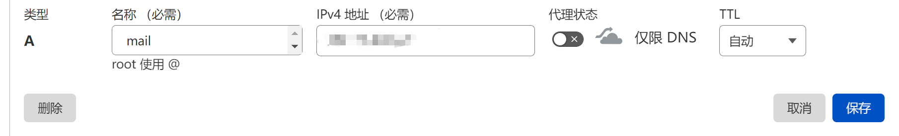
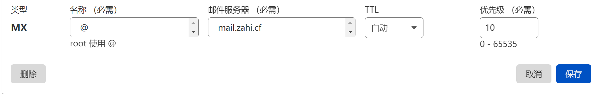
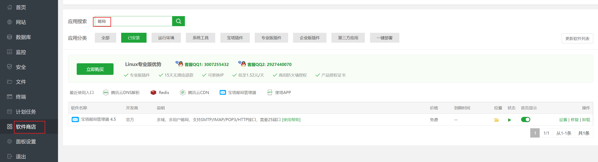
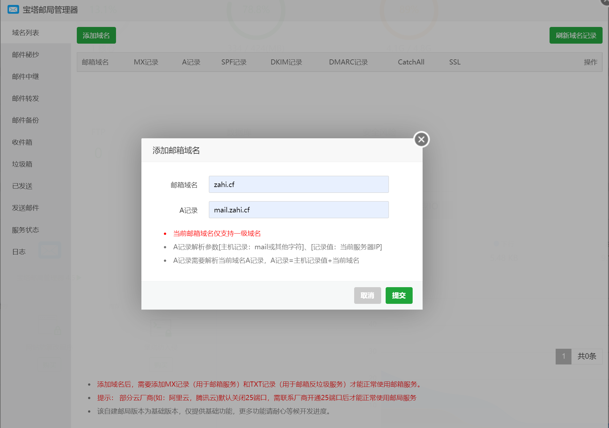
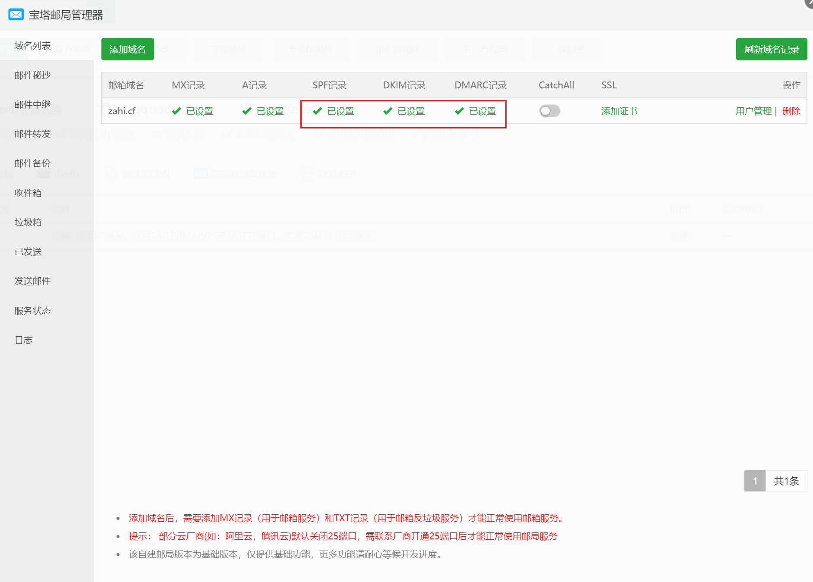
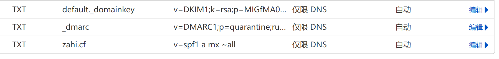
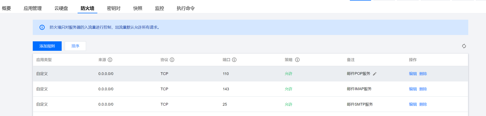

# 0、前言

既然现在有了自己的域名和服务器，那为何不搭建一个以自己域名为后缀的邮箱玩玩呢😎

有了自己的邮件服务器，就有了无限个账号，以后用来注册一些网站还是很方便的。

下面说一下搭建步骤

# 1、添加DNS解析

首先配置DNS解析，这里我用的是cloudflare，其他dns服务商同理。

先添加一条A记录，名称填`mail`，地址填服务器ipv4地址，不要勾代理，保存。

（PS：我的域名没有备案，所以解析到国内的服务器也不能访问自己的网站，但是用来做域名邮箱倒是可以，应该是因为端口不同吧）

再添加一条MX记录，名称填`@`，邮件服务器填 `mail.自己的域名`，优先级这里我随便填个10

# 2、安装宝塔邮局管理器

在软件商店里直接搜索并安装就可以了，非常简单

装完之后打开邮局管理器，点击添加域名，然后填上自己的域名和A记录，提交

提交成功后，下图红框这里应该是打红叉的，我没有截到那个图，这里就放一张最终的图。点击红叉，根据里面的提示在cloudflare再加3条DNS记录就好了

添加完后刷新域名记录，就变全绿了，如果没有变绿就等一会再试。

# 3、添加用户

在邮箱域名的右侧点击用户管理，添加一个用户

上图有IMAP/POP3/SMTP服务的地址和端口，如果想在其他邮箱客户端登录我们的邮箱，需要在防火墙放行这3个端口。

