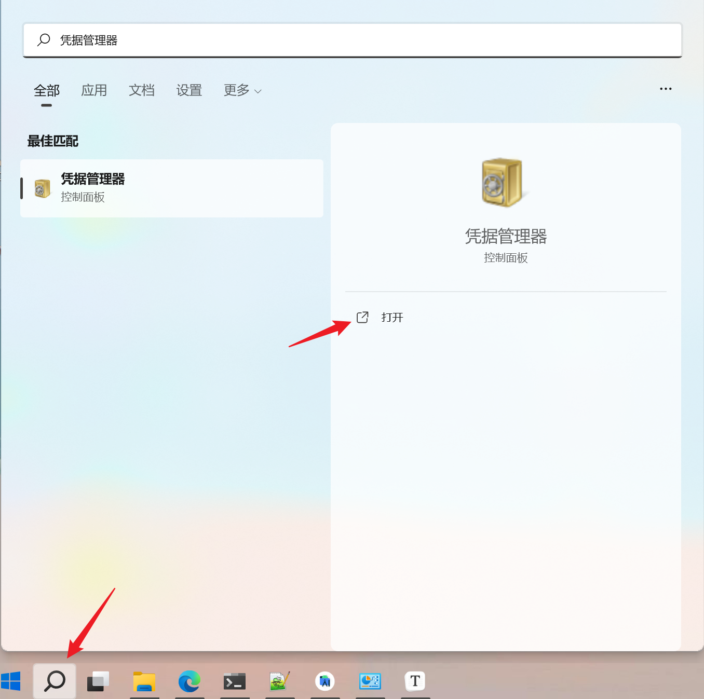
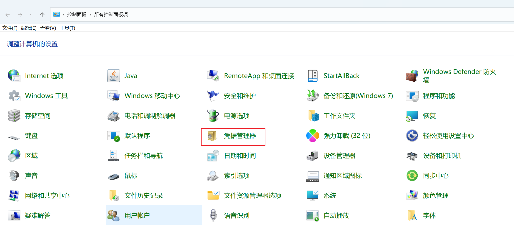
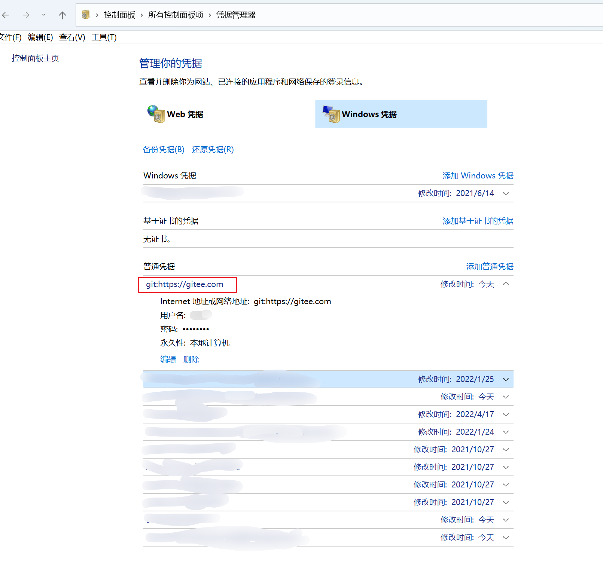

# 0、前言

我们平时连接远程仓库（如Github，Gitee）时，通常使用2种方式，一种是SSH，另一种是HTTPS。使用SSH方式的话需要配置SSH公钥，过程稍微有点小麻烦，所以我更偏向于使用HTTPS方式。但是使用HTTPS方式有一个缺点，就是当你修改网站的密码之后，再推/拉代码的时候会失败，需要我们手动修改一下电脑本地存储的密码。下面记录一下修改方法，以防忘记。

# 1、打开凭据管理器

第一种方法，点击左下角的搜索，输入凭据管理器，然后打开

 

第二种方法，打开控制面板，找到凭据管理器并打开

# 2、修改账号密码

打开凭据管理器之后，选择`Windows凭据`

 

然后就可以修改某个远程仓库的密码啦

